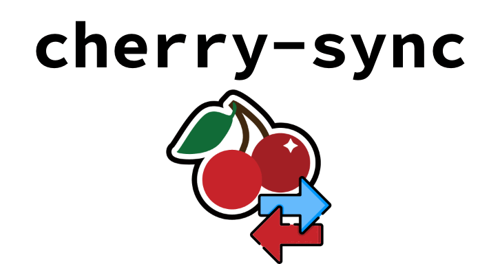

<div align="center">



An interactive `rsync` wrapper (CLI-based) for moving files selectively between a local machine and a remote dev environment over SSH. Cherry-pick your sync!

[](https://github.com/dpassarelli/cherry-sync/actions/workflows/test.yml)
[](https://github.com/dpassarelli/cherry-sync/actions/workflows/release.yml)

(see §[Testing](#testing) for more information)

</div>

## Problem

When working across a local machine and a remote dev environment over SSH, the workflow for moving files back and forth is a little clumsy. You either have to memorize `rsync` parameters or just move everything and sort through the details later. Plain `scp` has no incremental mode. What's missing is the middle step: see what's different and pick what moves.

This is a common situation for anyone working with SSH-accessible dev boxes, such as cloud instances, containers, Raspberry Pis, WSL-to-host, etc. [At least one macOS app](https://github.com/rsyncOSX/RsyncUI) exists for this purpose, but I couldn't find anything else that is cross-platform, runs directly on the command line, and has a rich terminal UX ⌨️ 🤓

## What this tool does

An interactive CLI that wraps `rsync` to provide a select-then-sync workflow:

1. Compare local and remote directories (using `rsync --dry-run --itemize-changes`).
2. Automatically exclude `.git` and honor `.gitignore` entries
3. Show a human-readable list of differences (new/modified/deleted).
4. Choose to sync all, none, or a subset of individual files.
5. Execute the transfer for only the selected files (using `rsync --files-from`) and report the outcome.

## Design principles

- **rsync does the heavy lifting.** This tool is a UX layer, not a reimplementation. It parses rsync's output and drives rsync's parameters for selective transfer.
- **SSH is the transport.** No additional daemon or agent on the remote side. If you can `ssh` to it, this tool works.
- **No opinion on direction.** Push and pull are both first-class. Bidirectional diff display is a future goal.
- **Minimal dependencies.** `rsync` and `ssh` must be present on both sides. The tool itself should be easy to install.

## Requirements

- `rsync` and `ssh` on both the local and remote machines
- [Go](https://go.dev/) ≥ 1.26.3 _if you want to build from source, otherwise [prebuilt binaries](https://github.com/DPassarelli/cherry-sync/releases/latest) are available_

## Install

### Download pre-built binary

Download the binary for your platform from the [latest release](https://github.com/dpassarelli/cherry-sync/releases/latest), make it executable, and put it on your `PATH`:

```sh
$ chmod +x cherry-sync_<version>_<platform>   # match the version and platform you downloaded
$ [sudo] mv cherry-sync_<version>_<platform> /usr/local/bin/csync
```

Each release also publishes a `checksums.txt` that you can use to verify the download against. The binary is self-contained; run `csync --license` to print the license terms it ships with.

The macOS binaries are code-signed and notarized with Apple, so Gatekeeper allows them to run without any extra steps. The first run of a browser-downloaded binary needs a working network connection, because macOS verifies the notarization with Apple at that point.

### Build from source

Clone this repo or [download the latest from main](https://github.com/DPassarelli/cherry-sync/archive/refs/heads/main.zip), and then:

```sh
$ go build ./cmd/csync
```

Produces a `csync` binary at the repo root.

## Usage

### Push (local to remote)

```sh
$ csync ./local-dir user@host:/remote-dir
```

### Pull (remote to local)

```sh
$ csync user@host:/remote-dir ./local-dir
```

csync compares the two directories and lets you choose what to transfer. **In a terminal** you get an interactive picker: arrow keys to move, space to toggle, `a` for all/none, Enter to sync, `ctrl-c` to cancel.

**When input or output is redirected** (such as a pipe, a file, CI), csync falls back to a typed prompt on stderr (so that the report on stdout stays uncluttered), where:
- press **Enter** (or `a`) to sync every change
- `n` or `ctrl-c` to cancel
- or pick a subset of changes by their numerical label:
    - a single number
    - a range like `1-3`
    - a comma list like `1,3`
    - or any combination thereof (`1-2,4`)

If the two directories are identical, csync reports there is nothing to sync and exits cleanly. An invalid invocation prints an error that explains the problem and points to `csync --help`, then exits with code 2.

`csync --help` (or `-h`) prints a usage summary and exits. `csync --version` prints the version and exits. Both take precedence over any other arguments.

### Saved targets

To avoid retyping a remote you sync with often, save it into `.csync.toml` in the project directory:

```toml
remote = "user@host:/remote-dir"
```

Then, from that directory, `csync push` sends the project to the saved remote and `csync pull` brings it down:

```sh
$ cd ./local-dir
$ csync push
```

The `push`/`pull` verbs take no other arguments. csync never offers the `.csync.toml` itself for transfer — like `.git`, it is held out of the comparison and reported as excluded. If the file is missing, malformed, or sets no `remote`, csync says so and exits non-zero rather than guessing.

### Run logs

csync logs every run that gets as far as comparing directories. These can be found in `$XDG_STATE_HOME/cherry-sync/`, or `~/.local/state/cherry-sync/` (when that variable is unset). At the end of the run, csync reports the name of the file it wrote, so you know exactly which one it was.

The directory is created `0700` and each log `0600` to keep details about your work tree private from others on the machine. The logs are plain text, and csync automatically caps the total number at 25 of the most recent. Each run deletes the oldest beyond that, and names what it removed in the log it is currently writing.

If the log cannot be written at all (for example, the state directory is read-only, or `XDG_STATE_HOME` points at something that isn't a directory) csync will let you know, but continues normally. The run ends with a `Not logged:` line explaining why, in place of the usual `Log:` line.

## Roadmap

Near-term enhancements are tracked as [open `enhancement` issues](https://github.com/DPassarelli/cherry-sync/issues?q=is%3Aissue%20state%3Aopen%20label%3Aenhancement) on GitHub.

Further out: bidirectional diff (showing which side is newer) and conflict flagging when a file has changed on both sides.

See the [CHANGELOG](CHANGELOG.md) for what has shipped in each release.

## Development

**Disclaimer:** I am a real person with many years of software engineering experience. I personally came up with this idea on my own, and I am the one driving the product design, reviewing code, managing issues, and maintaining documentation; however, I am working with [Claude](https://www.anthropic.com/product/claude-code) to write the code, suggest verbiage, and analyze security issues on this project. The evidence of this is sprinkled throughout.

The development process is mainly described in [TESTING](TESTING.md), with additional concerns covered in [STYLE](STYLE.md) and [SECURITY](SECURITY.md). Automated testing and a thorough CI workflow have been in place since the beginning in order to assure quality and reliability. The Gherkin specifications found under `acceptance_tests/features/` are the canonical definition of expected behavior and usage for this application.

## Testing

The project includes two workflows:

1. On every PR and commit to `main`, the unit and Gherkin tests are run (referred to as "Acceptance") against current GNU/Linux, as well as current and previous macOS; and
2. On every release, a quick smoke test is run against each built binary to ensure they are executable on the target platform.

### Acceptance tests

[](https://github.com/dpassarelli/cherry-sync/actions/workflows/test.yml)

| Environment | rsync implementation |
| ----------- | -------------------- |
| linux/amd64 | GNU |
| macOS/arm64 | system (macOS 15, discovered) |
| macOS/arm64 | openrsync (macOS 26) |

Each test workflow run publishes a detailed report to the job summary, which includes `rsync` identity, Gherkin-versus-unit breakdown, per-package results, and any failures.

To run these tests locally:

```sh
go test -count=1 ./...
```

> _The `-count=1` is deliberate: the suite builds and execs the `csync` binary rather than importing it, so Go's test cache doesn't notice production-code changes and a plain `go test ./...` can report a stale pass. See [TESTING](TESTING.md#running-tests) for the details._

### Smoke tests

[](https://github.com/dpassarelli/cherry-sync/actions/workflows/release.yml)

| Platform | How it runs |
| -------- | ----------- |
| linux/amd64 | native runner |
| linux/arm64 | ephemeral Azure VM |
| macOS/amd64 | Rosetta on an arm64 runner |
| macOS/arm64 | native runner |

## License

MIT — see [LICENSE](LICENSE).
